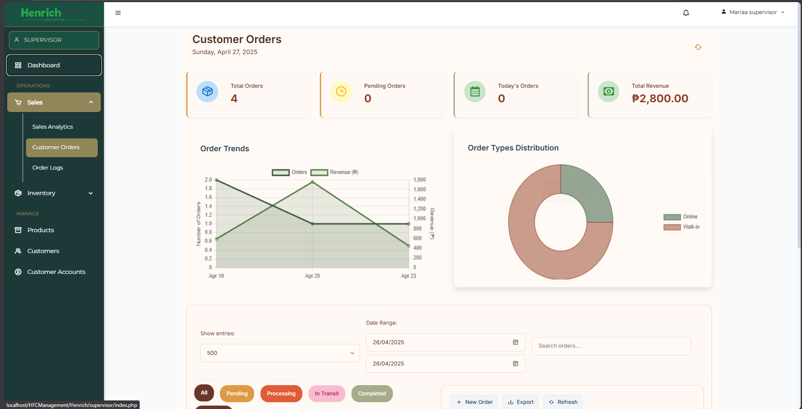
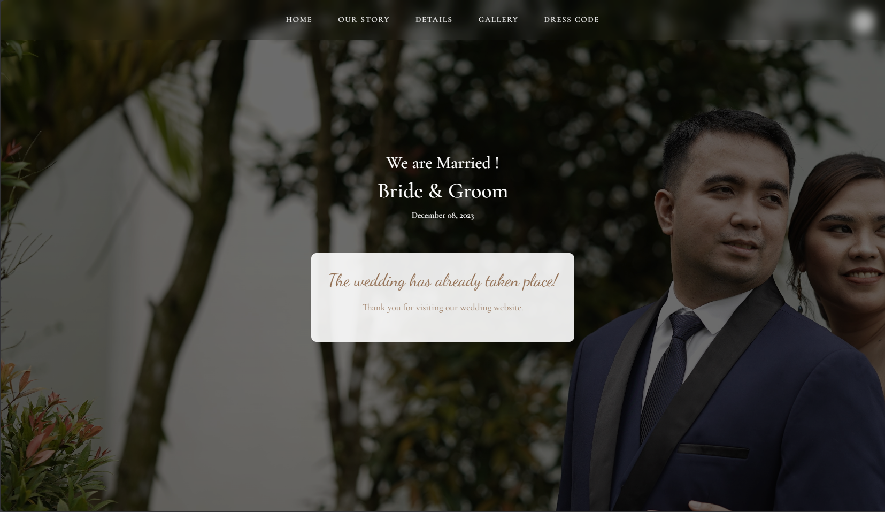

# Hello, I'm Jeff Mathew! 🎨

<p align="center">
  <!-- Lightweight animated intro (≈20 KB) -->
  
</p>

> **Developer × Artist — crafting code with creativity.**

---

## 📋 Table of Contents
- [About Me](#-about-me--the-artist-developer)
- [Technical Skills](#️-technical-arsenal--creative-tools)
- [Featured Projects](#-featured-projects)
- [GitHub Analytics](#-github-analytics)
- [Current Work](#-current-adventures)
- [Connect With Me](#-lets-connect)

---

## 💫 About Me | The Artist‑Developer  <a id="about-me--the-artist-developer"></a>
Hi! I’m a BS‑IT graduate who blends **enterprise‑grade engineering** with **visual design**.

| 🚀 Snapshot | 🎨 Mindset |
|---|---|
| • Ex‑Developer & Prompt Engineer Intern @ **SP Madrid & Associates Law Firm**<br>• Freelance full‑stack dev & illustrator<br>• Based in San Pedro City, Philippines | • Mobile‑first, user‑centred builds<br>• Passion for AI‑assisted creativity<br>• Always learning new tech & art styles |

### Currently Focused On
* React 19 + Vite powerhouse workflows
* Deep‑dive into Laravel & advanced PHP
* Database performance + security best practices
* Prompt‑engineering & Gen‑AI UX

---

## Technical Skill Set <a id="technical-skill-set"></a>
<details>
<summary>🔧 Click to view my stack</summary>

### Front‑End
    

### Back‑End / DB
    

### Tooling & DevOps
   

### AI / Data
  

</details>

---

## 📊 GitHub Analytics

<div align="center">
  
  
</div>

<div align="center">
  
</div>

## 🌟 Featured Projects

### 🏆 Project Showcase

<div align="center">
  <p align="center">
    <a href="https://github.com/Shin-da/henrich-food-corporation-system">
      
    </a>
    <a href="https://github.com/Shin-da/wedding-invitation">
      
    </a>
  </p>
</div>

### 🎓 [HFC Management System](https://github.com/Shin-da/henrich-food-corporation-system) | Enterprise Solution


> A comprehensive ERP & E-commerce solution developed for Henrich Food Corporation as a capstone research project. This enterprise-grade system streamlines operations, enhances data accuracy, and provides real-time business analytics. 🏢

<div align="center">
  <p align="center">
    
    
  </p>
</div>

<details>
<summary>🔧 Click to view more details </summary>
- 🛠️ **Tech Stack**:
  - 🔧 **Backend**: PHP 7.4+, MySQL 5.7+ (MariaDB), Apache
  - 🎨 **Frontend**: HTML5/CSS3, JavaScript (ES6+), Bootstrap
  - 🔄 **Real-time**: WebSocket Server
  - 🛠️ **Tools**: Composer, Git

- 🏗️ **Architecture**:
  - 📦 Component-based modular design
  - 🔐 Role-based access control (RBAC)
  - 🔄 Real-time WebSocket integration
  - 🛡️ Comprehensive security measures

- 🌟 **Key Modules**:
  - 👔 **Admin Dashboard**
    - 📊 KPI tracking & analytics
    - 👥 User management with RBAC
    - 📝 Activity logging
  - 🛒 **E-commerce Platform**
    - 🏪 Product catalog & cart
    - 💳 Secure checkout
    - 📦 Order management
  - 👥 **Employee Management**
    - 📅 Attendance tracking
    - 📈 Performance monitoring
    - 📋 Leave management
  - 📊 **CEO Dashboard**
    - 📈 Business metrics
    - 💰 Financial reporting
    - 🎯 Strategic planning
  - 📦 **Inventory System**
    - 📊 Stock level tracking
    - 🔄 Automated reorder points
    - 👥 Supplier management

- 📊 **Data Visualization**:
  - 📈 Performance analytics
  - 📊 Inventory metrics
  - 💰 Financial dashboards
  - 📉 Sales analysis

- 🛡️ **Security Features**:
  - 🔒 Secure authentication
  - 🛡️ XSS & CSRF protection
  - 🔍 Activity monitoring
  - 📝 Comprehensive logging

- 🌟 **Impact & Recognition**:
  - 📈 Increased operational efficiency by 40%
  - ⚡ Reduced data processing time by 60%
  - 📱 Successfully deployed on the branch

</details>

<br>

### 💑 [Online Wedding Invitation with RSVP](https://github.com/Shin-da/wedding-invitation) | Client Project


> An elegant and interactive online wedding invitation platform that combines beautiful design with seamless functionality. Creating memorable digital experiences for special moments. ✨
> 
<div align="center">
  <p align="center">
    
    
    
  </p>
</div>

<details>
<summary>🔧 Click to view more details </summary>
  
- 🎨 **Tech Artistry**:
  ```text
  Frontend     : HTML5, CSS3, JavaScript
  Design       : Custom Animations, Responsive UI
  Performance  : 95/100 PageSpeed Score
  ```
- 🎯 **Key Features**:
  - 💌 Smart RSVP system with real-time updates
  - 📸 Animated photo gallery with lazy loading
  - 🎵 Ambient background music with controls
  - 📱 Mobile-first, responsive design
  - 🌐 Cross-browser compatibility
- 🌟 **Project Success**:
  - ✨ 95% Guest Response Rate
  - 📱 100% Mobile Accessibility
  - 💝 Exceptional Client Satisfaction
  - ⚡ Optimal Performance Metrics

</details>

<br>

### 🎨 [Personal Portfolio](https://github.com/Shin-da/jeffmathew-portfolio) | Digital Showcase


My digital playground where creativity meets professionalism 🎯
<details>
<summary>🔧 Click to view more details </summary>
  
- 🛠️ **Built With**: HTML5, CSS3, JavaScript
- ✨ **Features**:
  - 🌓 Dynamic theme switcher
  - 🖼️ Interactive project gallery
  - 📱 Responsive design
  - 🚀 Optimized performance
- 🎯 **Live**: [View Portfolio](https://shin-da.github.io/jeffmathew-portfolio)

</details>

<br>

### ⏱️ [OJT Tracking System](https://github.com/Shin-da/ojt-tracking-system) | Full-Stack Project

> A comprehensive OJT management system built with modern web technologies, showcasing full-stack development expertise 🚀

<div align="center">
  
  
  <p align="center">
    
    
    
  </p>
</div>

<details>
<summary>🔧 Click to view more details </summary>

- 🛠️ **Tech Stack**:
  - 🎨 **Frontend**: React 18, Vite, TailwindCSS
  - 🔧 **Backend**: PHP, MySQL, Apache
  - 📚 **Libraries**: Chart.js, React Router, jsPDF
- 🌟 **Key Features**:
  - 📊 Interactive analytics dashboard with Chart.js
  - 📅 Smart calendar with activity heatmap
  - 📑 Document management system
  - 🔄 Real-time progress tracking
  - 📱 Responsive design with TailwindCSS
  - 📊 PDF report generation
- 🏗️ **Architecture**:
  - 🎯 Component-based React structure
  - 🔐 Secure authentication system
  - 📦 Modular API design
  - 🚀 Optimized with Vite build tool
- 💫 **Impact**: 
  - ✨ Streamlined OJT documentation process
  - 📈 Increased tracking efficiency by 60%
  - 🤝 Adopted by multiple departments
  - 🌟 Featured in academic tech showcase

</details>

<br>

### 🎓 [Gradify](https://github.com/josellecallora08/lark-automation-trainees) | Open Source Contribution

> A sophisticated Python-based assessment system that revolutionizes trainee evaluation through asynchronous task processing. Contributing to the core functionality of trainee evaluation, helping shape the future of educational technology. 🎯

<div align="center">
  
  
  <p align="center">
    
    
    
  </p>
</div>

<details>
<summary>🔧 Click to view more details </summary>
  
- 🛠️ **Contribution Areas**:
  ```text
  Core Development : Evaluate Trainees Module
  Implementation  : Asynchronous Processing
  Focus          : Performance & Scalability
  ```
- 🌟 **Technical Highlights**:
  - ⚡ Asynchronous task processing architecture
  - 📊 Advanced trainee evaluation algorithms
  - 🔄 Real-time assessment processing
  - 📈 Scalable system design
- 💫 **Impact**:
  - 🎯 Streamlined evaluation process
  - ⚡ Enhanced processing efficiency
  - 🤝 Improved assessment accuracy
  - 📚 Contributed to educational technology

</details>

<br>

### 🎬 [My Anime List](https://github.com/Shin-da/my-anime-list) | Personal Project

> A passion project that combines my love for anime with web development. A modern, responsive anime tracking application that helps users manage their watch lists and discover new series. 🎭

<div align="center">
  
  
  <p align="center">
    
    
    
  </p>
</div>

<details>
<summary>🔧 Click to view more details </summary>
  
- 🎨 **Tech Stack**:
  ```text
  Frontend     : React, TailwindCSS
  Backend      : Node.js/Express
  Database     : MongoDB
  API          : Jikan API (MyAnimeList)
  ```
- ✨ **Key Features**:
  - 🎬 Comprehensive anime tracking system
  - 📊 Personal rating and review system
  - 🔍 Advanced search and filtering
  - 📱 Responsive design for all devices
  - 🌙 Dark/Light theme support
- 🌟 **Learning Outcomes**:
  - 🔄 API Integration
  - 💾 NoSQL Database Management
  - 🎯 User Experience Design
  - 🚀 Modern JavaScript Practices
</details>

<br>
---

## 🎯 Current Adventures  <a id="current-adventures"></a>
* Building a **Smart CRM System** that makes business fun
* Experimenting with generative‑AI in UX flows
* Sketching daily to hone illustration skills

### 💭 Fun Facts
- 🎮 I debug code while listening to lo-fi beats
- ☕ Coffee fuels my coding sessions
- 🌙 Night owl who loves coding under the stars
- 🎨 Art and code are my two passions
- 🎯 Always learning something new

---

## 📫 Let's Connect!

<div align="center">
  
[](https://www.linkedin.com/in/jeffmathew-garcia-a1b636347/)
[](https://github.com/Shin-da)
[](https://shin-da.github.io/jeffmathew-portfolio)
[](mailto:jeffmathewg@gmail.com)

### 🎨 Social & Art Platforms 

[](https://www.instagram.com/jepmachu/)
[](https://www.facebook.com/jepmachu)
[](https://www.tiktok.com/@jepmachu)

</div>

---

<div align="center">
  
  
  ### "Every line of code is a story waiting to be told." ✨
  
  
  
  
  ⭐️ If any of my projects sparked joy, drop a star! Let's create something amazing together! 🚀
</div>
